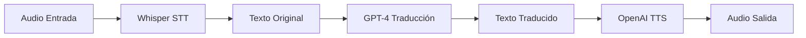
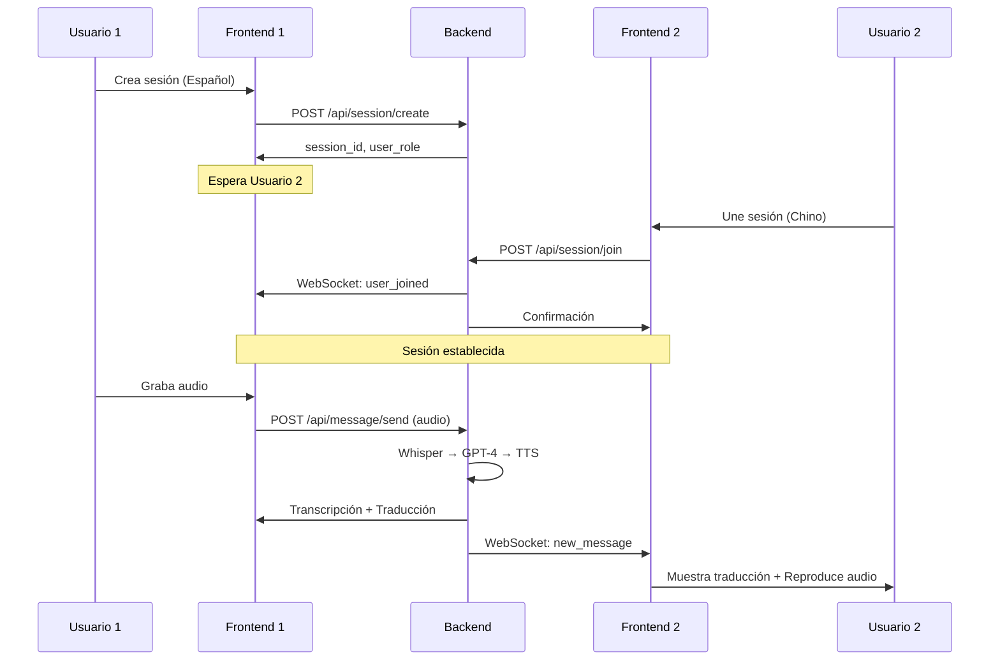
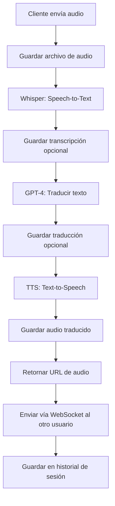
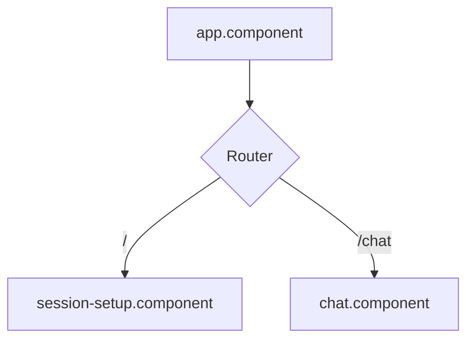
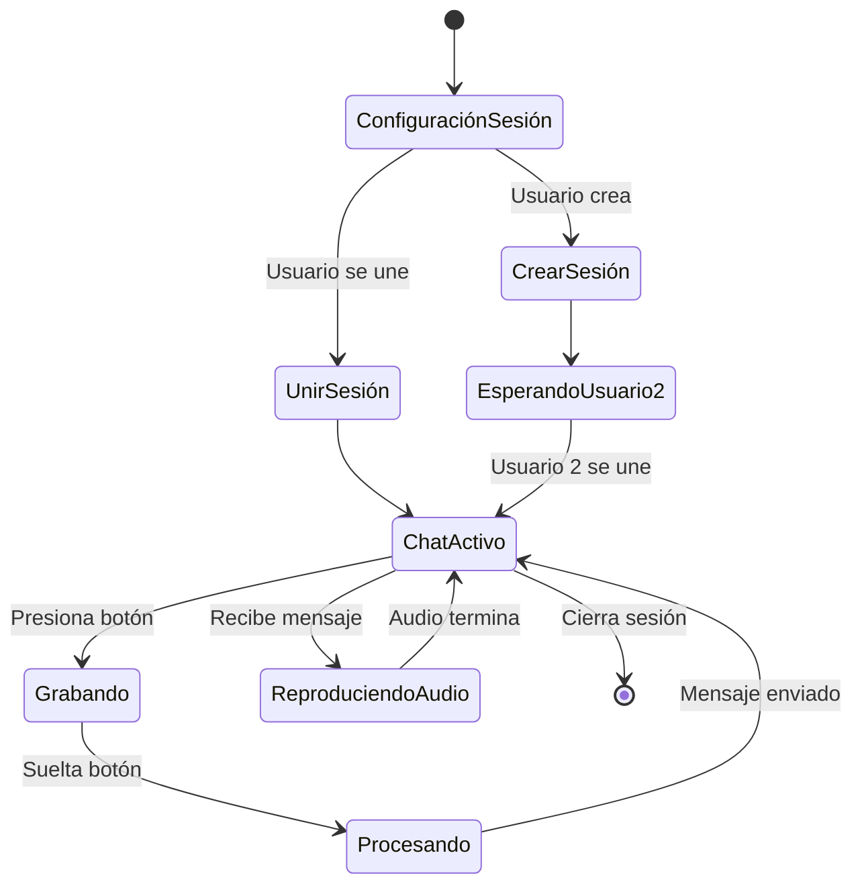
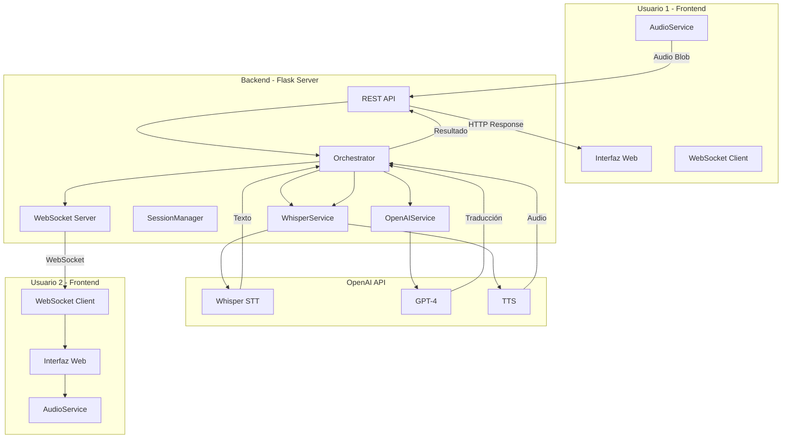

# AI Translator

Sistema de traducción bidireccional en tiempo real que permite la comunicación entre dos usuarios que hablan diferentes idiomas mediante un pipeline de procesamiento de audio y traducción automática.

## Descripción General

AI Translator es una aplicación web que facilita conversaciones en tiempo real entre dos personas que hablan idiomas distintos. El sistema captura audio del usuario, lo transcribe, traduce el texto al idioma del destinatario y genera una respuesta de audio en el idioma objetivo, todo de forma automática y bidireccional.

## Arquitectura del Sistema

### Componentes Principales

El proyecto está dividido en dos componentes principales:

1. **Backend**: API REST y WebSocket desarrollado en Python con Flask
2. **Frontend**: Aplicación web desarrollada con Angular 17

### Pipeline de Procesamiento



### Flujo de Comunicación Entre Usuarios



## Estructura del Proyecto

```
AI Translator/
├── backend/
│   ├── app.py                    # Aplicación Flask principal
│   ├── orchestrator.py           # Orquestador del pipeline
│   ├── session_manager.py        # Gestión de sesiones
│   ├── config/
│   │   ├── config.json          # Configuración del sistema
│   │   └── config.py            # Clase de configuración
│   ├── services/
│   │   ├── api_openai.py        # Servicio de traducción GPT-4
│   │   └── api_whisper.py       # Servicio STT y TTS
│   ├── prompt/
│   │   └── sp.prompt            # Plantilla de traducción
│   ├── data/
│   │   ├── audio/
│   │   │   ├── input/           # Audio original grabado
│   │   │   └── output/          # Audio traducido generado
│   │   └── text/
│   │       ├── input/           # Transcripciones
│   │       └── output/          # Traducciones
│   └── requirements.txt
│
└── frontend/
    ├── src/
    │   └── app/
    │       ├── app.component.ts           # Componente raíz
    │       ├── session-setup.component.ts # Configuración de sesión
    │       ├── chat.component.ts          # Interfaz de chat
    │       ├── audio.service.ts           # Servicio de grabación
    │       ├── translation.service.ts     # Servicio HTTP API
    │       ├── websocket.service.ts       # Servicio WebSocket
    │       ├── session.service.ts         # Gestión de sesión
    │       └── models.ts                  # Interfaces TypeScript
    └── package.json
```

## Backend

### Tecnologías Utilizadas

- **Flask 3.0.0**: Framework web principal
- **Flask-SocketIO 5.3.5**: Comunicación WebSocket en tiempo real
- **OpenAI API**: Servicios de Whisper (STT), GPT-4 (traducción) y TTS
- **Python-dotenv**: Gestión de variables de entorno

### Componentes del Backend

#### 1. Aplicación Principal (app.py)

Servidor Flask que expone endpoints REST y gestiona conexiones WebSocket.

**Endpoints principales:**

- `POST /api/session/create`: Crea una nueva sesión de traducción
- `POST /api/session/join`: Une un segundo usuario a una sesión existente
- `GET /api/session/<session_id>/info`: Obtiene información de la sesión
- `GET /api/session/<session_id>/messages`: Recupera historial de mensajes
- `POST /api/message/send`: Procesa y envía un mensaje traducido
- `GET /api/audio/<filename>`: Sirve archivos de audio generados
- `POST /api/translate`: Endpoint de traducción directa (sin sesión)
- `GET /api/health`: Health check del servidor

**Eventos WebSocket:**

- `connect`: Cliente conectado
- `disconnect`: Cliente desconectado
- `join_session`: Usuario se une a sala de sesión
- `new_message`: Nuevo mensaje traducido disponible
- `user_joined`: Segundo usuario se ha unido a la sesión

#### 2. Orquestador (orchestrator.py)

Clase `Orchestrator` que coordina el pipeline completo de traducción:

```python
audio_input → Whisper STT → texto_original → GPT-4 → texto_traducido → TTS → audio_output
```

**Responsabilidades:**

- Coordinar servicios de Whisper y OpenAI
- Gestionar almacenamiento de datos (audio, texto, historial)
- Aplicar plantillas de prompt para traducción
- Manejar configuración del sistema

#### 3. Gestor de Sesiones (session_manager.py)

Clase `SessionManager` que administra sesiones de usuario en memoria.

**Funcionalidades:**

- Crear sesiones únicas con identificadores de 6 caracteres
- Gestionar conexión de dos usuarios por sesión
- Mantener información de usuarios (nombre, idioma, socket_id)
- Almacenar historial de mensajes por sesión
- Facilitar enrutamiento de mensajes entre usuarios

**Estructura de sesión:**

```python
{
    'session_id': 'ABC123',
    'created_at': '2024-01-15T10:30:00',
    'users': {
        'user1': {
            'name': 'Juan',
            'language': 'es',
            'socket_id': 'xyz789'
        },
        'user2': {
            'name': 'Li Wei',
            'language': 'zh',
            'socket_id': 'abc456'
        }
    },
    'messages': [...]
}
```

#### 4. Servicios de API

**WhisperService (api_whisper.py):**

- `speech_to_text()`: Transcribe audio a texto usando Whisper
- `text_to_speech()`: Genera audio desde texto usando TTS
- `detect_language()`: Detecta idioma del audio (opcional)

**OpenAIService (api_openai.py):**

- `translate_text()`: Traduce texto entre idiomas usando GPT-4
- Utiliza sistema de prompts personalizable
- Configuración de temperatura y tokens ajustable

#### 5. Configuración (config/)

**config.json**: Define parámetros del sistema

```json
{
  "api": {
    "host": "0.0.0.0",
    "port": 3000,
    "debug": true
  },
  "openai": {
    "model": "gpt-4",
    "temperature": 0.3,
    "max_tokens": 500
  },
  "whisper": {
    "model": "whisper-1",
    "language_detection": true,
    "response_format": "json"
  },
  "tts": {
    "model": "tts-1",
    "voice": "alloy",
    "speed": 1.0
  }
}
```

**config.py**: Clase de configuración que:

- Carga y valida configuración desde JSON
- Crea directorios necesarios automáticamente
- Proporciona acceso tipado a configuraciones
- Maneja valores por defecto

### Flujo de Procesamiento de Mensajes



## Frontend

### Tecnologías Utilizadas

- **Angular 17**: Framework principal con componentes standalone
- **RxJS 7.8**: Programación reactiva
- **Socket.io-client 4.6**: Cliente WebSocket
- **TypeScript 5.3**: Tipado estático
- **MediaRecorder API**: Captura de audio del navegador

### Componentes del Frontend

#### 1. Arquitectura de Navegación



#### 2. Componente de Configuración (session-setup.component.ts)

Interfaz inicial que permite al usuario:

**Opción 1 - Crear Sesión:**
- Ingresar nombre de usuario
- Seleccionar idioma nativo
- Crear nueva sesión
- Recibir código de sesión único

**Opción 2 - Unirse a Sesión:**
- Ingresar código de sesión
- Ingresar nombre de usuario
- Seleccionar idioma nativo
- Conectar con sesión existente

**Idiomas soportados:**
- Español (es)
- English (en)
- Français (fr)
- Deutsch (de)
- Italiano (it)
- Português (pt)
- 中文 (zh)
- 日本語 (ja)

#### 3. Componente de Chat (chat.component.ts)

Interfaz principal de comunicación con las siguientes características:

**Funcionalidades:**

- Mostrar información de la sesión y usuarios conectados
- Botón de grabación (hold-to-talk)
- Lista de mensajes con transcripción y traducción
- Reproducción de audio traducido
- Indicadores de estado (grabando, procesando, reproduciendo)
- Notificaciones de errores

**Estados del sistema:**

- `isRecording`: Usuario está grabando audio
- `isProcessing`: Audio siendo procesado por el backend
- `isPlaying`: Reproduciendo audio de mensaje recibido

**Validaciones:**

- Sesión válida requerida
- Segundo usuario debe estar conectado para enviar mensajes
- Audio debe tener duración mínima (2 segundos)
- Tamaño mínimo de audio (5000 bytes)

#### 4. Servicios

**AudioService (audio.service.ts):**

Gestiona captura y reproducción de audio.

```typescript
// Métodos principales
initMicrophone(): Promise<boolean>
startRecording(): Promise<void>
stopRecording(): Promise<Blob>
playAudio(audioUrl: string): Promise<void>
cleanup(): void
```

**Características:**

- Solicita permisos de micrófono
- Configura MediaRecorder con formato webm/opus
- Captura audio en chunks de 1 segundo
- Manejo robusto de errores con mensajes específicos
- Limpieza automática de recursos

**TranslationService (translation.service.ts):**

Comunica con API REST del backend.

```typescript
// Métodos principales
translate(audioBlob, sourceLang, targetLang): Observable<TranslationResponse>
sendMessage(sessionId, userRole, audioBlob, sourceLang, targetLang): Observable<TranslationResponse>
```

**WebsocketService (websocket.service.ts):**

Gestiona comunicación en tiempo real.

```typescript
// Métodos principales
connect(serverUrl: string): void
joinSession(sessionId: string, userRole: string): void
disconnect(): void

// Observables
message$: Observable<any>
connected$: Observable<boolean>
userJoined$: Observable<any>
```

**SessionService (session.service.ts):**

Gestiona estado de sesión del usuario.

```typescript
// Métodos principales
createSession(userName, userLanguage): Observable<SessionCreateResponse>
joinSession(sessionId, userName, userLanguage): Observable<SessionJoinResponse>
getSessionInfo(sessionId): Observable<any>
getMessages(sessionId): Observable<any>
getCurrentSession(): Session | null
```

#### 5. Modelos de Datos (models.ts)

Define interfaces TypeScript para tipado fuerte:

```typescript
interface Session {
  sessionId: string;
  userRole: 'user1' | 'user2';
  myName: string;
  myLanguage: string;
  otherUserName: string;
  otherUserLanguage: string;
}

interface Message {
  id?: string;
  isMine: boolean;
  senderRole: string;
  originalText: string;
  translatedText: string;
  audioUrl?: string;
  timestamp: Date;
  isPlaying?: boolean;
}
```

### Flujo de Usuario



## Flujo de Datos Completo



## Instalación y Configuración

### Requisitos Previos

- Python 3.9 o superior
- Node.js 18 o superior
- npm 9 o superior
- Clave API de OpenAI

### Configuración del Backend

1. Navegar al directorio del backend:

```bash
cd backend
```

2. Crear entorno virtual de Python:

```bash
python -m venv venv
source venv/bin/activate  # En Windows: venv\Scripts\activate
```

3. Instalar dependencias:

```bash
pip install -r requirements.txt
```

4. Crear archivo `.env` con la clave API:

```bash
OPENAI_API_KEY=tu_clave_api_aqui
```

5. Verificar configuración en `config/config.json` y ajustar según necesidades.

6. Iniciar servidor:

```bash
python app.py
```

El servidor estará disponible en `http://0.0.0.0:3000`

### Configuración del Frontend

1. Navegar al directorio del frontend:

```bash
cd frontend
```

2. Instalar dependencias:

```bash
npm install
```

3. Configurar URL del backend en los servicios si es necesario:
   - Editar `src/app/session.service.ts`
   - Editar `src/app/translation.service.ts`
   - Editar `src/app/chat.component.ts`

4. Iniciar aplicación de desarrollo:

```bash
npm start
```

La aplicación estará disponible en `http://localhost:4200`

## Uso del Sistema

### Escenario: Conversación Español-Chino

**Usuario 1 (Español):**

1. Acceder a la aplicación web
2. Seleccionar "Crear Nueva Sesión"
3. Ingresar nombre: "María"
4. Seleccionar idioma: "Español"
5. Presionar "Crear Sesión"
6. Compartir código de sesión (ej: "ABC123") con Usuario 2
7. Esperar confirmación de conexión de Usuario 2

**Usuario 2 (Chino):**

1. Acceder a la aplicación web
2. Seleccionar "Unirse a Sesión Existente"
3. Ingresar código de sesión: "ABC123"
4. Ingresar nombre: "李伟"
5. Seleccionar idioma: "中文"
6. Presionar "Unirse"
7. Conectar automáticamente al chat

**Comunicación:**

Usuario 1:
1. Mantener presionado botón de grabación
2. Hablar en español: "Hola, mucho gusto en conocerte"
3. Soltar botón
4. Esperar procesamiento
5. Ver transcripción en español
6. Ver traducción al chino

Usuario 2:
1. Recibir notificación de nuevo mensaje
2. Ver traducción en chino: "你好，很高兴认识你"
3. Escuchar audio en chino automáticamente
4. Responder en chino siguiendo el mismo proceso

## Características Técnicas Destacadas

### Seguridad y Validación

- Sanitización de nombres de archivo con `secure_filename`
- Validación de sesiones antes de procesar mensajes
- Gestión de errores robusta en cada capa
- Limpieza automática de recursos de audio

### Optimización de Performance

- Chunks de audio de 1 segundo para captura continua
- Configuración de bitrate óptima (128kbps)
- Compresión webm/opus para reducir tamaño de transferencia
- Cache control en respuestas de audio

### Escalabilidad

- Arquitectura modular y desacoplada
- Servicios independientes para cada funcionalidad
- Configuración centralizada
- Diseño preparado para múltiples sesiones concurrentes

### Experiencia de Usuario

- Interfaz responsiva con feedback visual
- Mensajes de error específicos y accionables
- Estados claros del sistema (grabando, procesando, esperando)
- Diseño intuitivo con indicadores de progreso

## Limitaciones Actuales

1. **Almacenamiento en Memoria**: Las sesiones se almacenan en memoria del servidor. Si el servidor se reinicia, se pierden todas las sesiones activas.

2. **Sin Persistencia**: No hay base de datos. El historial de mensajes solo existe durante la vida de la sesión.

3. **Límite de Usuarios**: Cada sesión está diseñada para exactamente 2 usuarios.

4. **Formato de Audio**: Solo soporta webm en entrada y mp3 en salida.

5. **Dependencia de OpenAI**: Toda funcionalidad de procesamiento depende de disponibilidad de API de OpenAI.

6. **Sin Autenticación**: No hay sistema de usuarios o autenticación.

## Posibles Mejoras Futuras

1. **Base de Datos**: Implementar PostgreSQL o MongoDB para persistencia
2. **Autenticación**: Sistema de usuarios con JWT
3. **Salas Múltiples**: Soporte para más de 2 usuarios por sesión
4. **Chat de Texto**: Opción de enviar mensajes de texto sin audio
5. **Historial Persistente**: Guardar conversaciones para acceso posterior
6. **Procesamiento Offline**: Queue system para procesar mensajes asíncronamente
7. **Detección Automática de Idioma**: Eliminar necesidad de seleccionar idioma manualmente
8. **Indicadores de Typing**: Mostrar cuando el otro usuario está grabando
9. **Mejoras de UI**: Visualización de forma de onda durante grabación
10. **Optimización de Costos**: Cache de traducciones comunes

## Tecnologías y APIs

### Backend
- Python 3.9+
- Flask 3.0.0
- Flask-SocketIO 5.3.5
- OpenAI Python SDK 1.50.0+

### Frontend
- Angular 17.1.0
- TypeScript 5.3.2
- Socket.io-client 4.6.1
- RxJS 7.8.0

### APIs Externas
- OpenAI Whisper: Speech-to-Text
- OpenAI GPT-4: Traducción de texto
- OpenAI TTS: Text-to-Speech

## Licencia

Este proyecto es un prototipo desarrollado con fines demostrativos.

## Contacto y Soporte

Para preguntas o problemas relacionados con el proyecto, consultar la documentación en el archivo `ACTUALIZACION.md` que contiene información sobre problemas corregidos y flujos actualizados.

## Notas Importantes

- Asegurarse de tener una clave API válida de OpenAI
- El uso de las APIs de OpenAI genera costos según uso
- Para producción, considerar implementar rate limiting
- Revisar configuración de CORS para ambiente de producción
- Los archivos de audio se acumulan en directorios locales, implementar limpieza periódica
