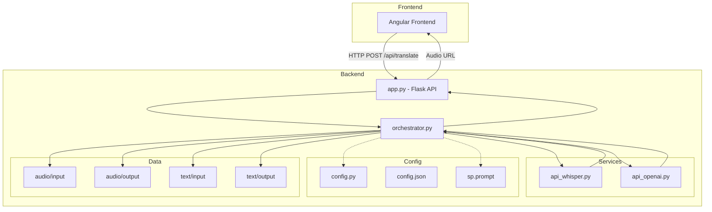
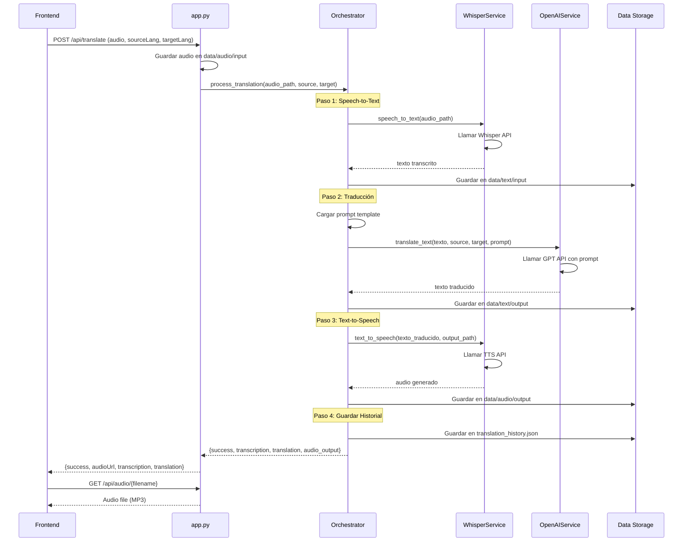
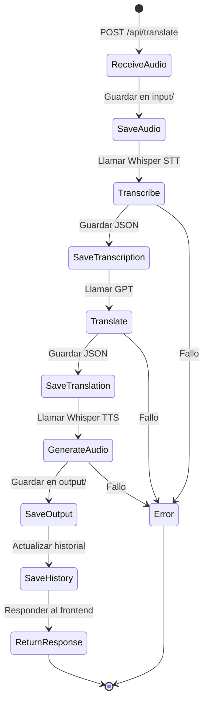
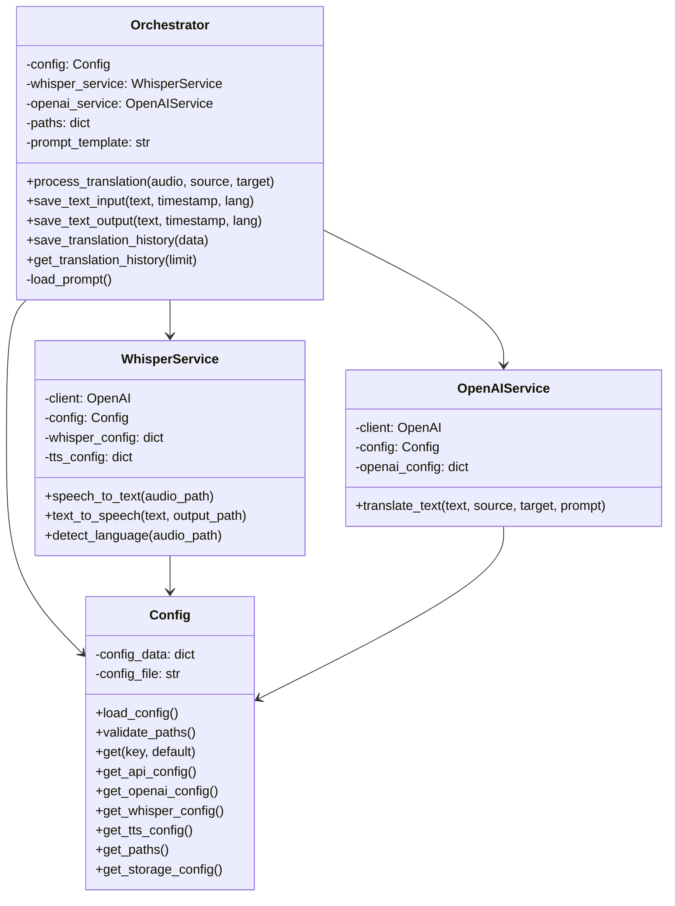

# Backend - Sistema de Traducción Bidireccional

## Descripción

Backend para sistema de traducción bidireccional que procesa audio mediante un pipeline de Speech-to-Text (Whisper), traducción (GPT), y Text-to-Speech (Whisper TTS).

## Arquitectura del Sistema



## Flujo de Procesamiento Completo



## Estructura de Directorios

```
backend/
├── app.py                      # API Flask principal
├── orchestrator.py             # Coordinador de servicios
├── requirements.txt            # Dependencias Python
├── .env.example               # Variables de entorno ejemplo
├── .gitignore                 # Archivos ignorados
│
├── config/
│   ├── config.json            # Configuración parametrizable
│   └── config.py              # Clase de configuración
│
├── services/
│   ├── api_whisper.py         # Servicio Whisper (STT y TTS)
│   └── api_openai.py          # Servicio GPT (traducción)
│
├── prompt/
│   └── sp.prompt              # Template de prompt para GPT
│
└── data/
    ├── audio/
    │   ├── input/             # Audios recibidos del frontend
    │   └── output/            # Audios generados (traducidos)
    └── text/
        ├── input/             # Transcripciones originales
        └── output/            # Traducciones y historial
```

## Componentes Principales

### 1. app.py

API Flask que expone endpoints HTTP para el frontend.

**Endpoints:**

- `POST /api/translate`: Recibe audio y parámetros de traducción
- `GET /api/audio/<filename>`: Sirve archivos de audio generados
- `GET /api/history`: Retorna historial de traducciones
- `GET /api/health`: Health check del servicio

**Flujo:**
1. Recibe FormData con audio y idiomas
2. Guarda audio en data/audio/input
3. Invoca orchestrator.process_translation()
4. Retorna URL del audio traducido

### 2. orchestrator.py

Coordina el flujo completo de traducción entre los servicios.

**Clase: Orchestrator**

**Métodos principales:**
- `process_translation(audio_path, source_lang, target_lang)`: Pipeline completo
- `save_text_input(text, timestamp, language)`: Guarda transcripción
- `save_text_output(text, timestamp, language)`: Guarda traducción
- `save_translation_history(data)`: Guarda en historial JSON
- `get_translation_history(limit)`: Recupera historial

**Pipeline de procesamiento:**
1. Transcribir audio (Whisper STT)
2. Guardar transcripción
3. Traducir texto (GPT)
4. Guardar traducción
5. Generar audio (Whisper TTS)
6. Guardar en historial

### 3. services/api_whisper.py

Servicio que interactúa con OpenAI Whisper API.

**Clase: WhisperService**

**Métodos:**
- `speech_to_text(audio_file_path)`: Convierte audio a texto
- `text_to_speech(text, output_path)`: Convierte texto a audio
- `detect_language(audio_file_path)`: Detecta idioma del audio

**Características:**
- Usa modelo whisper-1 para STT
- Usa modelo tts-1 para TTS
- Configurable desde config.json

### 4. services/api_openai.py

Servicio que interactúa con OpenAI GPT API.

**Clase: OpenAIService**

**Métodos:**
- `translate_text(text, source_lang, target_lang, prompt_template)`: Traduce texto

**Características:**
- Usa GPT-4 por defecto
- Temperatura 0.3 para traducciones consistentes
- Prompt template parametrizable

### 5. config/config.py

Gestiona la configuración desde config.json.

**Clase: Config**

**Métodos:**
- `load_config()`: Carga configuración desde JSON
- `validate_paths()`: Crea directorios si no existen
- `get(key, default)`: Obtiene valor de configuración
- `get_api_config()`: Configuración de API
- `get_openai_config()`: Configuración de OpenAI
- `get_whisper_config()`: Configuración de Whisper
- `get_tts_config()`: Configuración de TTS
- `get_paths()`: Rutas de archivos
- `get_storage_config()`: Configuración de almacenamiento

## Configuración

### config.json

```json
{
  "api": {
    "host": "0.0.0.0",
    "port": 3000,
    "debug": true
  },
  "openai": {
    "model": "gpt-4",
    "temperature": 0.3,
    "max_tokens": 500
  },
  "whisper": {
    "model": "whisper-1",
    "language_detection": true,
    "response_format": "json"
  },
  "tts": {
    "model": "tts-1",
    "voice": "alloy",
    "speed": 1.0
  },
  "paths": {
    "audio_input": "data/audio/input",
    "audio_output": "data/audio/output",
    "text_input": "data/text/input",
    "text_output": "data/text/output",
    "prompt": "prompt/sp.prompt"
  },
  "storage": {
    "save_audio": true,
    "save_text": true,
    "save_history": true,
    "history_file": "data/text/output/translation_history.json"
  }
}
```

### Variables de Entorno

Crear archivo `.env`:

```bash
OPENAI_API_KEY=sk-your-api-key-here
```

## Instalación

### Requisitos

- Python 3.8 o superior
- pip
- OpenAI API Key

### Pasos

1. Instalar dependencias:

```bash
cd backend
pip install -r requirements.txt
```

2. Configurar variables de entorno:

```bash
cp .env.example .env
# Editar .env y agregar OPENAI_API_KEY
```

3. Verificar configuración:

```bash
# Revisar config/config.json
# Ajustar parámetros según necesidades
```

## Ejecución

```bash
python app.py
```

El servidor iniciará en `http://0.0.0.0:3000`

## Almacenamiento de Datos

### Estructura de Audio

**Input (data/audio/input/):**
```
input_20240206_143022.webm
input_20240206_143045.webm
```

**Output (data/audio/output/):**
```
translated_20240206_143022.mp3
translated_20240206_143045.mp3
```

### Estructura de Texto

**Input (data/text/input/):**
```json
{
  "timestamp": "20240206_143022",
  "language": "es",
  "text": "Hola, ¿cómo estás?"
}
```

**Output (data/text/output/):**
```json
{
  "timestamp": "20240206_143022",
  "language": "en",
  "text": "Hello, how are you?"
}
```

### Historial de Traducciones

**data/text/output/translation_history.json:**
```json
[
  {
    "timestamp": "20240206_143022",
    "source_lang": "es",
    "target_lang": "en",
    "original_text": "Hola, ¿cómo estás?",
    "translated_text": "Hello, how are you?",
    "audio_input": "data/audio/input/input_20240206_143022.webm",
    "audio_output": "data/audio/output/translated_20240206_143022.mp3"
  }
]
```

## Flujo de Estados



## API Reference

### POST /api/translate

Procesa audio y retorna traducción.

**Request:**
- Content-Type: `multipart/form-data`
- Fields:
  - `audio`: File (WebM/Opus)
  - `sourceLang`: String (código ISO)
  - `targetLang`: String (código ISO)

**Response:**
```json
{
  "success": true,
  "audioUrl": "/api/audio/translated_20240206_143022.mp3",
  "transcription": "Hola, ¿cómo estás?",
  "translation": "Hello, how are you?"
}
```

### GET /api/audio/<filename>

Sirve archivo de audio generado.

**Response:**
- Content-Type: `audio/mpeg`
- Body: Audio file binary

### GET /api/history?limit=10

Retorna historial de traducciones.

**Response:**
```json
{
  "success": true,
  "history": [...]
}
```

### GET /api/health

Health check del servicio.

**Response:**
```json
{
  "success": true,
  "status": "healthy",
  "timestamp": "2024-02-06T14:30:22"
}
```

## Diagrama de Clases



## Manejo de Errores

El sistema implementa manejo de errores en cada capa:

1. **Validación de entrada**: Verifica audio y parámetros
2. **Try-catch en servicios**: Captura errores de APIs externas
3. **Logging**: Registra errores para debugging
4. **Respuestas estructuradas**: Retorna siempre success flag y error message

## Consideraciones de Seguridad

- API Key de OpenAI en variable de entorno
- Validación de nombres de archivos con secure_filename
- CORS configurado para permitir frontend específico
- Rate limiting recomendado en producción

## Optimizaciones Futuras

- Caché de traducciones frecuentes
- Queue system para procesamiento asíncrono
- Compresión de archivos de audio
- Cleanup automático de archivos antiguos
- Streaming de audio para menor latencia

## Tecnologías Utilizadas

- Flask 3.0.0
- OpenAI Python SDK 1.12.0
- Flask-CORS 4.0.0
- Python-dotenv 1.0.0

## Licencia

MIT
