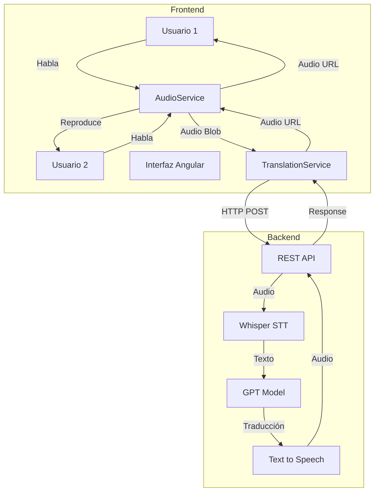
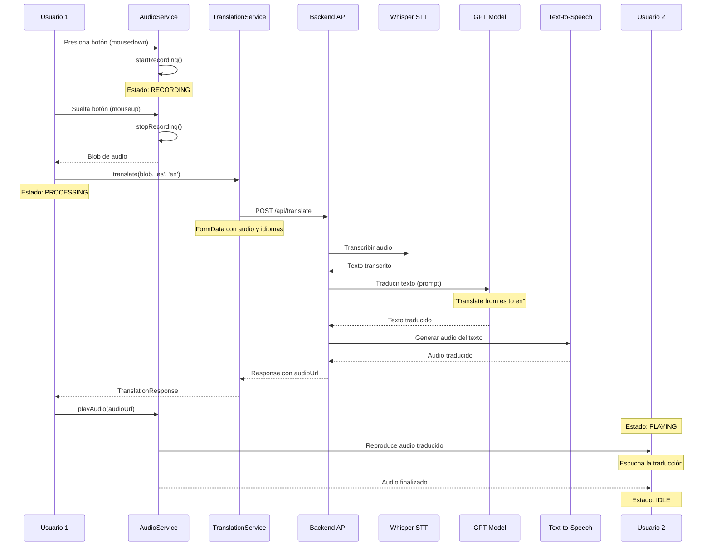
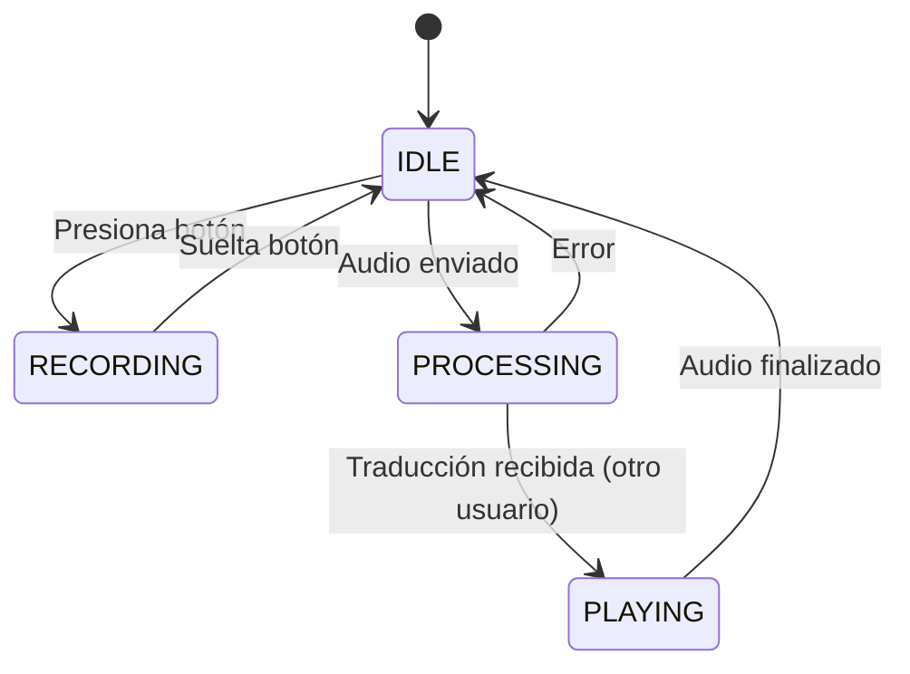
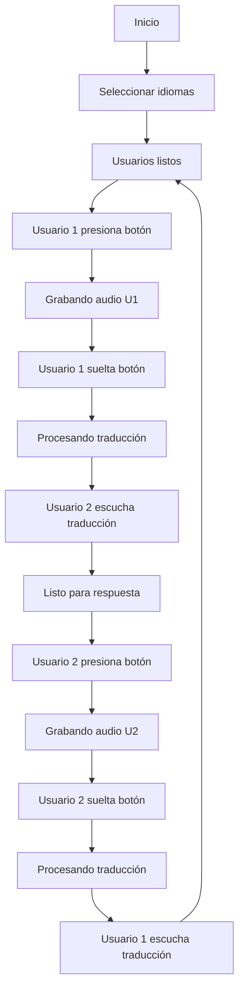
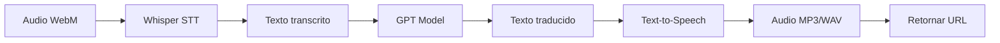
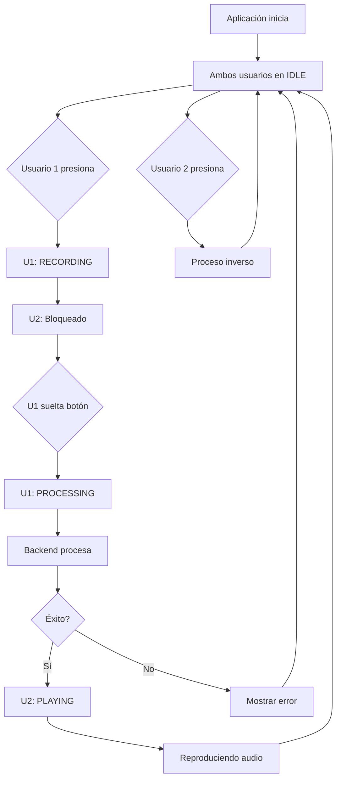

# Sistema de Traducción Bidireccional

## Descripción

Sistema de traducción bidireccional que permite la comunicación entre dos usuarios que hablan diferentes idiomas. El sistema captura audio de un usuario, lo procesa a través de un pipeline de traducción (Whisper + GPT + TTS) en el backend, y reproduce el resultado traducido al otro usuario.

## Arquitectura del Sistema



## Flujo de Traducción Detallado



## Componentes Principales

### 1. AppComponent

Componente principal que gestiona la interfaz y coordina los servicios.

**Responsabilidades:**
- Gestionar el estado de ambos usuarios
- Controlar el flujo de grabación y reproducción
- Manejar la selección de idiomas
- Mostrar mensajes de error

**Estados por usuario:**
- IDLE: Usuario inactivo, listo para grabar
- RECORDING: Grabando audio
- PROCESSING: Enviando y procesando traducción
- PLAYING: Reproduciendo audio traducido



### 2. AudioService

Servicio que gestiona la captura y reproducción de audio.

**Métodos principales:**
- `initMicrophone()`: Solicita permisos y accede al micrófono
- `startRecording()`: Inicia la grabación de audio
- `stopRecording()`: Detiene y retorna el Blob de audio
- `playAudio(url)`: Reproduce un audio desde una URL
- `cleanup()`: Libera recursos del micrófono

**Características:**
- Formato: WebM con códec Opus
- Sample rate: 44100 Hz
- Echo cancellation y noise suppression habilitados

### 3. TranslationService

Servicio HTTP que se comunica con el backend.

**Método principal:**
- `translate(audioBlob, sourceLang, targetLang)`: Envía audio y recibe traducción

**Request:**
```typescript
FormData {
  audio: Blob,
  sourceLang: string,
  targetLang: string
}
```

**Response:**
```typescript
{
  success: boolean,
  audioUrl?: string,
  transcription?: string,
  translation?: string,
  error?: string
}
```

## Flujo de Interacción Usuario



## Estructura del Proyecto

```
traductor-v2.0/
├── src/
│   ├── app/
│   │   ├── app.component.ts       # Componente principal
│   │   ├── app.component.html     # Template
│   │   ├── app.component.scss     # Estilos
│   │   ├── audio.service.ts       # Servicio de audio
│   │   ├── translation.service.ts # Servicio HTTP
│   │   └── models.ts              # Interfaces y tipos
│   ├── index.html                 # HTML principal
│   ├── main.ts                    # Entry point
│   └── styles.scss                # Estilos globales
├── angular.json                   # Configuración Angular
├── tsconfig.json                  # Configuración TypeScript
└── package.json                   # Dependencias
```

## Modelos de Datos

### Language
```typescript
interface Language {
  code: string;    // Código ISO 639-1
  name: string;    // Nombre del idioma
}
```

### TranslationRequest
```typescript
interface TranslationRequest {
  audioBlob: Blob;
  sourceLang: string;
  targetLang: string;
}
```

### TranslationResponse
```typescript
interface TranslationResponse {
  success: boolean;
  audioUrl?: string;
  transcription?: string;
  translation?: string;
  error?: string;
}
```

### RecordingState
```typescript
enum RecordingState {
  IDLE = 'idle',
  RECORDING = 'recording',
  PROCESSING = 'processing',
  PLAYING = 'playing'
}
```

## Instalación y Ejecución

### Requisitos
- Node.js 18.x o superior
- npm 9.x o superior

### Instalación

```bash
cd Traductor-v2.0
npm install
```

### Desarrollo

```bash
npm start
```

La aplicación estará disponible en `http://localhost:4200`

### Build de Producción

```bash
npm run build
```

## Configuración del Backend

El frontend espera un backend en `http://localhost:3000/api` con el siguiente endpoint:

### POST /api/translate

**Request:**
- Content-Type: `multipart/form-data`
- Body:
  - `audio`: File (WebM/Opus)
  - `sourceLang`: String (código de idioma)
  - `targetLang`: String (código de idioma)

**Response:**
```json
{
  "success": true,
  "audioUrl": "http://backend.com/audio/translated.mp3",
  "transcription": "Hello, how are you?",
  "translation": "Hola, ¿cómo estás?",
  "error": null
}
```

## Pipeline de Backend Esperado



El backend debe:
1. Recibir el audio en formato WebM/Opus
2. Transcribir usando Whisper (audio → texto)
3. Traducir usando GPT con prompt: "Translate the following text from {sourceLang} to {targetLang}: {text}"
4. Convertir a audio usando TTS (texto → audio)
5. Guardar el audio y retornar URL accesible

## Idiomas Soportados

- Español (es)
- English (en)
- Français (fr)
- Deutsch (de)
- Italiano (it)
- Português (pt)
- 中文 (zh)
- 日本語 (ja)

## Características de Diseño

### Paleta de Colores
- Background Primary: #1a1d29
- Background Secondary: #232734
- Background Card: #2a2f3f
- Text Primary: #e4e6eb
- Text Secondary: #b0b3b8
- Accent: #5b8def
- Success: #52c41a
- Error: #ff4d4f
- Warning: #faad14

### Responsive
- Desktop: Grid de 3 columnas (Usuario 1 | Divisor | Usuario 2)
- Tablet/Mobile: Layout vertical apilado

### Estados Visuales
- Botón azul: Usuario listo
- Botón rojo pulsante: Grabando
- Botón amarillo: Procesando
- Botón verde: Reproduciendo traducción

## Flujo de Estados Detallado



## Consideraciones Técnicas

### Seguridad
- El micrófono requiere HTTPS en producción
- Validación de tamaño de archivos en el backend
- Límite de tasa en las peticiones

### Performance
- Audio comprimido con Opus para reducir tamaño
- Streaming de audio cuando sea posible
- Caché de configuraciones de idiomas

### Manejo de Errores
- Validación de permisos de micrófono
- Timeout en peticiones HTTP (30s recomendado)
- Mensajes de error claros al usuario
- Reintentos automáticos en caso de fallo de red

## Tecnologías Utilizadas

- Angular 17.1.0 (Standalone Components)
- TypeScript 5.3.2
- RxJS 7.8.0
- SCSS
- MediaRecorder API
- HTTP Client

## Licencia

MIT
